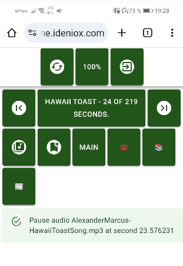

## Abstract

A Web App to manage your bookmarks. Also has a minimal audio player and allow to define audios metadata.

This is a [Next.js](https://nextjs.org/) project bootstrapped with [`create-next-app`](https://github.com/vercel/next.js/tree/canary/packages/create-next-app).

It requires `node@18.17` and `npm@10.8.2` to run, or just a latest version of `docker`



## Installation

Copy `.env.local` to `.env` and write your actual values for `${BOOKMARKS_PASSWORD}`, `${BOOKMARKS_MUSIC_FOLDER}` and `${BOOKMARKS_DATA_FOLDER}`.

Place your own bookmarks as a HTML file under `${BOOKMARKS_DATA_FOLDER}/bookmarks.html`, worked to import from google bookmarks export format. It also works with an empty html file.

Place the urls you want to check in a json string[] under `${BOOKMARKS_DATA_FOLDER}/check.json`.

Place your own audio files under `${BOOKMARKS_MUSIC_FOLDER}`, it works only with `mp3` files.

Copy `.env.local` to `.env` and write your actual values for `${BOOKMARKS_PASSWORD}`, `${BOOKMARKS_MUSIC_FOLDER}` and `${BOOKMARKS_DATA_FOLDER}`.

Then select your preferred method:

### NPM

```bash
git clone git@github.com:JorgeMartinezPizarro/bookmarks.git
cd bookmarks
npm install
npm run start
```

### DOCKER

```bash
git clone git@github.com:JorgeMartinezPizarro/bookmarks.git
cd bookmarks
docker compose down --remove-orphans
docker compose up -d
```

Navigate to [http://localhost:3000](http://localhost:3000) to start using the app.

## Build and push

```bash
docker build -t jorgemartinezpizarro/bookmarks:latest . 
docker push jorgemartinezpizarro/bookmarks:latest
```

If you want to generate your own images use your own hub namespace.
